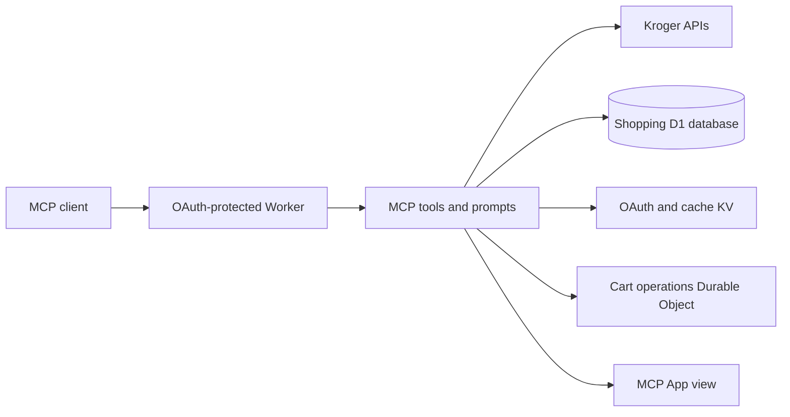

# From “what's for dinner?” to a Kroger-ready list

[](https://github.com/aranlucas/ai-shopping-mcp/actions/workflows/ci.yml)
[](LICENSE)


_Concept artwork for the grocery MCP; the Worker serves the tools and app view described below._

An OAuth-protected MCP server that gives AI clients a way to plan meals, check Kroger and QFC products and weekly deals, organize shopping lists, and prepare cart additions. A bundled interactive MCP App makes lists and product results easier to review.

> “Use what's in my pantry, plan three vegetarian dinners, then make a list of what I need from Kroger.”

The host AI handles the meal plan; this Worker supplies the shopper-specific pantry, product, store, list, deal, and cart tools.

## A grocery workflow with real store context

- Find Kroger products and compare weekly deals for a preferred store.
- Keep pantry, equipment, order history, and shopping lists in one shopper profile.
- Turn recipe ingredients into a list, review matches, and choose which matched items to add to the cart.
- Use the bundled MCP App to review lists, check items off, and retry safely after an uncertain cart response.
- Connect over remote MCP OAuth to compatible clients.

Shopping, product search, stores, and weekly deals are Kroger/QFC-only.

## How the Worker is wired



## Run locally

Requires Node.js 24.18.1 or newer and pnpm 12.6. Wrangler runs the Worker locally; set Kroger client credentials in the ignored `.dev.vars` file before testing OAuth or shopping requests.

```sh
pnpm install
pnpm db:migrate:local
pnpm start
```

The local Worker runs at `http://localhost:8788`. The database schema is in `src/db/schema.ts`; generate a migration after schema changes with `pnpm db:generate`. To preview the MCP App with sample data, run `pnpm dev:views` and open `http://127.0.0.1:5173/preview.html`.

```sh
pnpm lint
pnpm typecheck
pnpm test
pnpm build
```

## Connect an MCP client

The deployed service accepts remote MCP connections at:

```text
https://ai-meal-planner-mcp.aranlucas.workers.dev/mcp
```

Clients that require a local proxy can use `mcp-remote`:

```json
{
  "mcpServers": {
    "kroger-shopping": {
      "command": "pnpm",
      "args": [
        "dlx",
        "mcp-remote",
        "https://ai-meal-planner-mcp.aranlucas.workers.dev/mcp"
      ]
    }
  }
}
```

## Production resources and data

User shopping data is stored in D1 and scoped to the authenticated Kroger shopper. OAuth grants use `OAUTH_KV`; cart operations use the `CART_OPERATIONS` Durable Object; caches and compatibility receipts use `USER_DATA_KV`.

The schema is defined in [`src/db/schema.ts`](src/db/schema.ts). Apply local migrations with `pnpm db:migrate:local`; apply remote migrations before a Worker deployment with `pnpm db:migrate:remote`. Required production secrets are `KROGER_CLIENT_ID`, `KROGER_CLIENT_SECRET`, and `COOKIE_ENCRYPTION_KEY`. `SENTRY_DSN` is optional.

---

### Tool dependencies

MCP dependencies are assembled in [`src/composition.ts`](src/composition.ts)
with ordinary TypeScript function calls. Each request constructs its own
authenticated clients, shopper-specific storage, and MCP server. Each tool
registration receives the server and an explicit dependency object checked by
TypeScript.

Tool registrations receive named repositories and operations directly. Preferred-store
access uses a `PreferredLocationStore`; pantry, equipment, orders, and lists have
their own contracts. `ShoppingStore` groups those repositories for the persistence
implementation, while tools depend on the individual repositories they use.

Weekly-deal caching is an adapter with a domain-level interface. It owns the KV
implementation and no-cache behavior, so tool dependencies do not contain nullable
KV bindings. Weekly-deal lookup and cache-only item annotations share that adapter.

For example, the weekly-deals loader declares the operations it needs:

```ts
type WeeklyDealsLoaderDependencies = {
  preferredLocation: PreferredLocationStore;
  productClient: KrogerClients["productClient"];
  weeklyDealsCache: WeeklyDealsCache;
};
```

Wire dependencies in the composition code and pass only the operations each
module uses. Tool tests call the same registration functions with plain dependency
objects. Keep shopper-specific storage, authenticated Kroger clients, and cart
persistence local to each request.

## Production resources

Deploy from this repository with:

```bash
pnpm build
pnpm deploy
```

Keep the Worker name, KV namespace IDs, and Durable Object lifecycle declarations in `cloudflare.config.ts` stable. Configure these runtime secrets in Cloudflare:

- `KROGER_CLIENT_ID`
- `KROGER_CLIENT_SECRET`
- `COOKIE_ENCRYPTION_KEY`
- `SENTRY_DSN` (optional; enables errors-only Sentry reporting)

Apply pending D1 migrations before deploying a Worker that uses the new schema:

```bash
pnpm db:migrate:remote
```

Register the exact production callback URL with Kroger:

```text
https://ai-meal-planner-mcp.aranlucas.workers.dev/callback
```

The Kroger application must allow `profile.compact`, `cart.basic:write`, and `product.compact`.

## MCP surface

The server exposes 13 tools:

- Stores: `search_stores` (by zip code, or one store's details by `storeId`), `set_preferred_store`
- Products and deals: `search_products` (text terms and/or exact UPCs in one `terms` list), `shop_for_items`, `get_weekly_deals`
- Household: `get_shopping_profile`, `update_inventory`, `record_order`
- Lists and cart: `create_shopping_list`, `get_shopping_list`, `update_shopping_list`, `add_shopping_list_to_cart`, `view_cart`

Most tools default to the preferred store, and cart adds default to `PICKUP`.
See `docs/tool-surface-review.md` for why the surface is shaped this way.

### Kroger product search

`shop_for_items` uses TypeSafe Jev (`typesafe/jev-1.13`) by default through the existing
Cloudflare `AI` binding and the `default` AI Gateway, using OpenRouter BYOK. It sends the entire list
(up to 10 requested items) in one inference call, with one Choice question and
up to 20 candidate products per item. Jev chooses one candidate or
returns no match / needs review. Explicitly out-of-stock products are excluded;
`addToCart: true` also requires a UPC and curbside fulfillment. Model errors,
invalid responses, or a five-second timeout return a tool error before any list or
cart write. There is no fallback model or heuristic picker.

Store an OpenRouter key under alias `default` on the `default` gateway. The
Worker binding authenticates automatically; no provider key is stored in the
application. Jev uses OpenRouter's Decisions API through
`AI.gateway("default").run()` with provider `openrouter` and endpoint
`../alpha/decisions`. This resolves outside OpenRouter's usual `/api/v1` base
to `/api/alpha/decisions`. Gateway retries are explicitly limited to one attempt.
The live smoke test (`pnpm test:selector:live`) runs an ephemeral local Worker
with a remote AI binding using Wrangler login or Cloudflare environment credentials.
Run `pnpm eval:selector:live` for the 30-case live evaluation, or append an output path and `--holdout` for
12 additional fixed cases. These use synthetic catalogs and never write a list or cart.

`search_products` searches Kroger directly using one optional `storeId`, defaulting
to the preferred Kroger store. Terms run concurrently; a failed term retains its
error type and recovery guidance while successful terms remain usable. An all-digit
term is an exact UPC lookup (five Kroger calls at a time, no limit on how many)
that also returns the product's other variants with their UPCs, allergens, dietary
claims, ingredients, nutrition, rating, and storage. Text terms follow Kroger's
limits: at least 3 characters, trimmed to 8 words, at most 10 per call.

Products use UPCs throughout the tools, domain model, and app. Copy `upc` from
search results into lists and orders. There is no
provider registry or capability dispatch. Name-only list items still need a Kroger
match before they can be added to the cart.

### Editing a list by hand

Lists live in the Worker's D1 database and are edited through `get_shopping_list` (with
no arguments it returns every list and its id; with a `listId`, or a list `name`
matched case-insensitively, it returns that list's items and their `itemId`s),
then `update_shopping_list`, which adds, changes, and removes items in one call. List items accept
`upc` values or plain `productName` entries for unmatched ingredients, plus an
optional unit `price`. `shop_for_items` stores each match's current Kroger price,
so list results include an estimated total (`~$42.18 est.`).

All the list tools render the shopping-list app view, so the list in the chat
stays current after every edit. In the app, items can be checked off (checked
items move to the bottom), their quantity changed, or removed. Edits appear
immediately and roll back if the server rejects them. After adding a list to the
cart, **Mark as purchased** records the matched items with `record_order`.

`update_inventory` edits the pantry and kitchen equipment. A `pantry.remove`
entry with a `quantity` uses up part of an item (the pantry view's **Use one**
button); the item is removed when none is left.

It exposes four workflow prompts:

- `plan_shopping_route`
- `set_preferred_store`
- `shop_recipe_ingredients`
- `plan_meals_from_pantry`

### Planning meals around weekly deals

Pass `includeWeeklyDeals: true` to `get_shopping_profile` to combine your pantry,
expiring ingredients, equipment, and recent purchases with up to ten QFC/Kroger offers:

```json
{ "includeWeeklyDeals": true, "storeId": "70500847" }
```

Omit `storeId` to use your preferred Kroger store. This option also works with an
empty pantry, so the assistant can plan meals from sale items and identify everything
you need to buy. The host model still writes the meal plan.

The summary reuses the default `get_weekly_deals` cache and preserves offer prices,
conditions, validity dates, and warnings. Stale ads are explicitly labeled; unavailable
deals leave pantry context usable with recovery guidance. Call `get_weekly_deals` for
more offers, then `search_products` to confirm exact products and current prices before
creating a list. Without `includeWeeklyDeals`, the profile makes no deal requests.

The primary small-model contract is concise text in `content[0].text`. MCP App routing metadata stays in `_meta`; do not treat `structuredContent` as the reasoning payload.

### Cart outcomes and retries

List-backed cart writes reserve an atomic journal entry before contacting Kroger.
The journal is scoped to the authenticated user and OAuth client. Concurrent calls
for the same list cannot submit twice. Completed operations remain recorded even
if the legacy KV receipt fails; pending operations do not expire into permission
to retry. A lost upstream response is reported as `MUTATION_OUTCOME_UNKNOWN` with
`recovery: "check_cart"`. Check the real Kroger cart before starting a new operation;
the assistant mirror is not proof of the upstream outcome.

For inline cart items, supply a unique `operationId` and reuse it for retries.
Reusing an id with changed items is rejected. Calls without an id remain supported
for compatibility but have no cross-request deduplication key. A new id means a
new intentional cart add. The one-shot `shop_for_items` workflow creates a new list
on every call; retry its cart step using the returned `listId`, not by repeating
the whole workflow.

Product buttons in the app retain the original list for a cart retry and coalesce
concurrent clicks. Both product and saved-list views replace retry controls with
**Check Kroger cart** after an unknown outcome or lost cart response.

Cart UI behavior belongs to `views/app/cart-action.ts`, with React integration in
`use-cart-action.ts`. Its states are `idle`, `submitting`, `added`, `already_added`, `needs_match`,
`retryable`, and `check_cart`; views derive controls from that state instead of maintaining separate
loading, error, and recovery flags. Add new cart transitions there so product and
saved-list actions keep the same retry rules. Shopping search results follow the
same pattern in `src/services/shopping-outcomes.ts`: classify each requested item
once as matched, not found, needing review, or failed, then consume that outcome.

The `v3` migration adds the SQLite-backed `CartOperations` class. Deploy the code,
binding, and migration together. Retain the old `v1`/`v2` migration history.

Kroger requests have a 10-second deadline and inherit HTTP request
cancellation. GET responses with 502/503/504 are retried once after 200ms within
that same deadline, unless the server supplies `Retry-After`. Mutations are never
automatically retried. MCP errors include `structuredContent.error` with `code`,
`message`, and `recovery`; concise text remains the primary model-facing payload.

## Connect a client

Clients with remote MCP and OAuth support can connect directly to:

```text
https://ai-meal-planner-mcp.aranlucas.workers.dev/mcp
```

For a client that still needs a local proxy:

```json
{
  "mcpServers": {
    "kroger-shopping": {
      "command": "pnpm",
      "args": [
        "dlx",
        "mcp-remote",
        "https://ai-meal-planner-mcp.aranlucas.workers.dev/mcp"
      ]
    }
  }
}
```

## MCP App preview

Run `pnpm dev:views` and open `http://127.0.0.1:5173/preview.html` to review the app with
sample data and a simulated host. Switch between shopping lists, products, weekly deals,
stale results, loading, empty, and error states. The **Fail actions** control exercises
retry feedback; **Unknown cart outcome** simulates a lost cart confirmation to verify
the check-cart action. The theme selector checks light and dark rendering. Preview actions do not
contact a shopping account. The preview entry is excluded from the production app bundle.

The preview also includes the list index (**All lists**), the editable list, and
the cart view. **Save to list** on a product asks which saved list to use, or
creates a new one. Product details link to the product page on kroger.com when
Kroger provides one. `view_cart` renders the live cart, or the items added
through the assistant when no cart id is known.

Weekly deals can be filtered by category, and **Find product** opens matching products inside
the app using the deal's store. Shopping-list actions distinguish Kroger matches from unmatched
items and add matched items to the pickup cart. The user completes the purchase in Kroger.

## Validation

```bash
pnpm build
pnpm test
pnpm eval:mcp
pnpm cf-typegen
```

`pnpm lint` runs both the standard rules and a focused type-aware pass via `oxlint-tsgolint`.
Floating Promises (including `void` expressions and `ResultAsync` thenables) and misused async
callbacks fail lint and build. The focused configuration avoids enabling unrelated type-aware
style rules across the repository. Synchronous `Result` consumption, including handling an
`Err` after `await`, still requires review.

The same command runs [`@shadcn/lint`](https://github.com/shadcn-ui/lint) on the
React views. `.oxlintrc.json` enables `no-restyle`, `require-static-classes`, and
`no-inline-styles`, and recognizes relative UI imports and the shared component
barrel. Components own their appearance: use Badge `tone` values (`success`,
`warning`, `danger`, `info`, or `muted`) and Button variants instead of overriding
their colors. Explicit contracts allow container spacing, carousel item gutters,
and skeleton rounding. Shared UI implementations retain their existing lint
exclusion. The existing Tailwind plugin continues to check utility validity,
arbitrary values, and hardcoded colors via `.oxlintrc.tailwind.json`.

The live Jev selection check is separate because it uses Cloudflare credentials and incurs usage. It exercises the production selector with synthetic products, including a no-match case, without shopping-list or cart writes:

```bash
pnpm test:selector:live
```

Locally it uses the active Wrangler login. In CI it requires `CLOUDFLARE_API_TOKEN` and `CLOUDFLARE_ACCOUNT_ID`.
